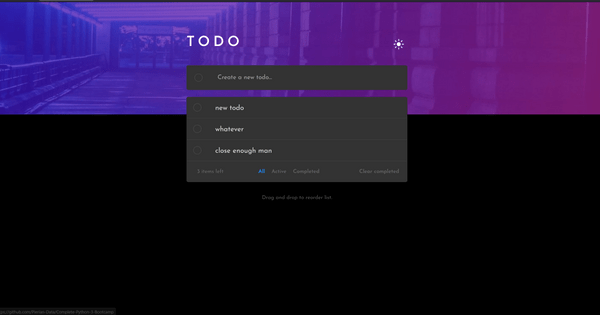
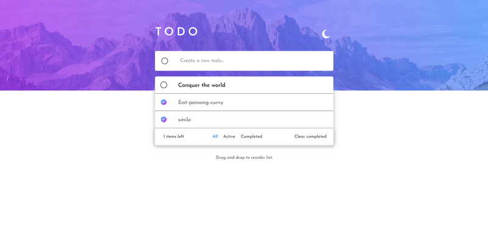
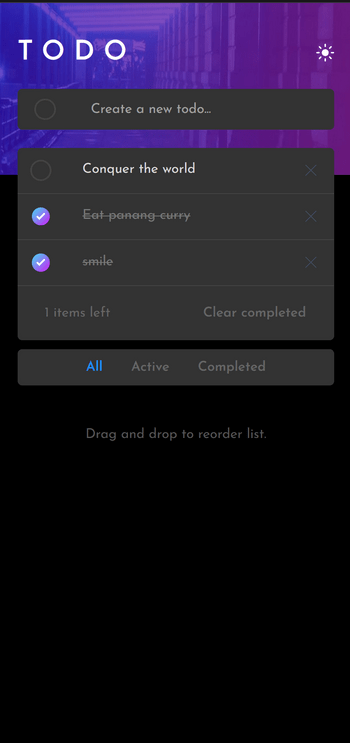

# Super To-do app using React and Vite

This is a solution to the [Todo app challenge on Frontend Mentor](https://www.frontendmentor.io/challenges/todo-app-Su1_KokOW).
## Table of contents

- [Overview](#overview)
  - [The challenge](#the-challenge)
  - [Screenshot](#screenshot)
  - [Links](#links)
- [My process](#my-process)
  - [Built with](#built-with)
  - [What I learned](#what-i-learned)
  - [Continued development](#continued-development)
  - [Useful resources](#useful-resources)
- [Author](#author)
- [Acknowledgments](#acknowledgments)


## Overview

### The challenge

Users should be able to:

- View the optimal layout for the app depending on their device's screen size
- See hover states for all interactive elements on the page
- Add new todos to the list
- Mark todos as complete
- Delete todos from the list
- Filter by all/active/complete todos
- Clear all completed todos
- Toggle light and dark mode
- Drag and drop to reorder items on the list

### Screenshot






### Links

- Solution URL: [Github repo](https://github.com/PeshwariNaan/countries-a-plenty.git)
- Live Site URL: [Live link](https://peshwarinaan.github.io/frontend-mentor-todo-list/)

## My process

### Built with

- React
- Vite
- Flexbox
- CSS Grid
- Mobile-first workflow
- [React](https://reactjs.org/) - JS library- 
- [Styled Components](https://styled-components.com/) - For styles

### What I learned

This was an interesting project for me. I have been getting more familiar with useReducer and useContext for smaller applications that don't need a more robust state management such as Redux. I aim to have really clean and modular code for efficiency and ease of bebugging. I try to adhere to good coding practices such as keeping business logic out of the reducers and not prop drilling which I think I achieved in this little project. I learned quite a bit with using more advanced aspects of styled components. An example woould be how to hover over an element and have a hover effect take place on a different element without having to use something cumbersome with mouseover. The more I use styled-components, the more I love it and I don't have to use BEM or run any risk of conflicting styles.

```
export const CheckImage = styled.img`
  display: none;
  transition: display 0.5s ease-in-out;
  width: 1.75rem;
  height: 1.75rem;

//Easy hover trick**
  ${TaskContainer}:hover & {
    display: block;
     
  }
```
This was also the first time I had used drag and drop functionallity which was a little frustrating to find how to use it by mapping in functional components to a list rather that just mapping simple divs which every tutorial I find seems to do. It worked in the end and Im really happy with the result. This was also the first project that I have used Vite rather than Create-React-App. Wow - what a difference in speed. I loved it.


### Continued development

I really spent a lot of time with the styled component docs and I will continue to push hard with the library until I know all of it. I really don't like spending lots of time on minor design details so the better I know it, the more I get done and the better I feel.

 I also need to explore the different ways to persist state and load data from loacl storage. I found a lot of resources on different ways to do it and I don't think mine was the best way. I feel this is worth knowing well.

### Useful resources

I always start with stack overflow

## Author

- Frontend Mentor - [@PeshwariNaan](https://www.frontendmentor.io/profile/PeshwariNaan)


## Acknowledgments

I would like to tip my hat to all the students - old and young - that are giving some of these projects their all. It's not easy, keep it up.